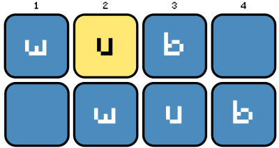

**wubwub** is a novelty music production package for Python.  Using the easy audio manipulation of [pydub](https://github.com/jiaaro/pydub), wubwub allows you to place and edit sounds to make musical arrangements.  

## Quick Start

The wubwub Sequencer is the starting point for making music.  Create one with a specified tempo and length:

```python
import wubwub as wb

seq = wb.Sequencer(bpm=120, beats=8)
```

Samples can be loaded into the sequencer in different tracks (with a name provided for easier access):

```python
kick = seq.add_sampler('sounds/kick1.wav', name='kick')
hihat = seq.add_sampler('sounds/hihat.wav', name='hihat')
snare = seq.add_sampler('sounds/snare1.wav', name='snare')
```

There are multiple ways of adding musical elements (like MIDI information) to each track:

```python
# use helper methods to create notes
kick.make_notes(beats=[1, 3, 5, 7])

hihat.make_notes_every(freq=.5)

# initialize notes and add them with set-item syntax
snare[[2::2]] = wb.Note() # 2, 4, 6, 8
snare[8.5] = wb.Note()
```

Individual notes can be modified by specifying the pitch, length, and volume.  Pitches can be specified in [scientific pitch notation](https://en.wikipedia.org/wiki/Scientific_pitch_notation) or in semitones:

```python
bass = seq.add_sampler('sounds/bass_C4.wav', name='bass', basepitch='C4')
bass.make_notes(beats=[1, 2.5, 5, 7.5], pitches=['C3', 'Ab2', 'Eb3', 'Bb2'])

synth = seq.add_sampler('sounds/saw_C4', name='synth', basepitch='C4')
synth.make_notes_every(freq=.5, pitches=[3, 2, 3, -2], lengths=[.25, .25, .25, .5])
# Eb4, D4, Eb4, Bb3
```

Add effects to tracks using [pysndfx](https://github.com/carlthome/python-audio-effects):

```python
from pysndfx import AudioEffectsChain

synth.effects = AudioEffectsChain().reverb(reverberance=65, wet_gain=2)
```

Playback your creation:

```python
seq.play()
```

Or export it:

```python
seq.export('my_beat.wav')
```

 ## Other features & functions to help create stuff...
- Arpeggiator and multi-sampler tracks
- Split a single sequencer, or join multiple together
- Loop play
- Set the overall volume or panning of a track
- Duplicate tracks, or copy/paste sections of a track
- Create chords (by adding notes, or specifying their name)
- Text diagrams and plots for visualizing the sequencer

## Gallery

- Electro
- LoFi
- Arpeggio
- Ten

The above examples are all created with samples from `wubwub.sounds`.  This module allows you to download and access a collection of musical samples collected from [SampleSwap](https://sampleswap.org/).  

## Installation

You can install wubwub with pip:

```
pip install wubwub
```

You may also want to install other software to make full use of wubwub:

- [ffmpeg](http://www.ffmpeg.org/) will allow for importing/exporting of more file types (rather than WAV).   On Mac, ffmpeg can be easily installed with brew (`brew install ffmpeg`).  On Windows, you will need to download the binaries and add them to your PATH.  [This tutorial](https://www.youtube.com/watch?v=r1AtmY-RMyQ) provides a nice demonstration of how to do so.
- [pysndfx](https://github.com/carlthome/python-audio-effects) can be used to add audio effects to tracks in wubwub.  This is not automatically installed with wubwub, but it can be pip installed (`pip install pysndfx`).  To use these effects, you will also need to have [Sox](http://sox.sourceforge.net/) installed.  This can be installed [with conda](https://anaconda.org/groakat/sox), but there are other options listed on the Sox website

## Documentation

Full docstrings and example usage for wubwub are in the making.  For now, refer to the examples in the Gallery above if you would like to try playing around with wubwub.  Feel free to share any questions on the issues page.

## Contributing

There are a few ways you can help improve wubwub:

- Use it and share any bugs or problems on the [issues page](https://github.com/earnestt1234/wubwub/issues).
- Create something with wubwub (e.g. a small loop or musical vignette) that could be added to the example gallery.  Preferably, your example would only use sounds from `wubwub.sounds` so that others could reproduce it.  But if not, I may still want to share it.  There is an "example" issue label where you can share your example.
- I would be thrilled about others also improving the code base; I am not very familiar with handling pull requests from others, but would be certainly interested in trying to incorporate them.