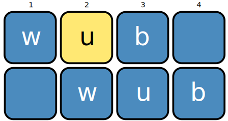

**wubwub** is a novelty music production package for Python.

## Overview

wubwub is mainly built around the easy audio manipulation provided by [pydub](https://github.com/jiaaro/pydub).  Tools in wubwub allow you to place sounds in musical arrangements.  To start, you need to create a Sequencer with a tempo and a length:

```python
import wubwub as wb

seq = wb.Sequencer(bpm=120, beats=8)
```

You can then add sounds as different musical tracks.  The most basic one is a sampler:

```
# load sounds from your computer
kick = seq.add_sampler('sounds/kick1.wav', name='kick')
hihat = seq.add_sampler('sounds/hihat.wav', name='hihat')
snare = seq.add_sampler('sounds/snare1.wav', name='snare')
```


## Gallery

- Electro
- LoFi
- Arpeggio
- Ten

The above examples are all created with samples from `wubwub.sounds`.  This module allows you to download and access a collection of musical samples collected from [SampleSwap](https://sampleswap.org/).  

## Installation

You can install wubwub with pip:

```
pip install wubwub
```

You may also want to install other software to make full use of wubwub:

- [ffmpeg](http://www.ffmpeg.org/) will allow for importing/exporting of more file types (rather than WAV).   On Mac, ffmpeg can be easily installed with brew (`brew install ffmpeg`).  On Windows, you will need to download the binaries and add them to your PATH.  [This tutorial](https://www.youtube.com/watch?v=r1AtmY-RMyQ) provides a nice demonstration of how to do so.
- [pysndfx](https://github.com/carlthome/python-audio-effects) can be used to add audio effects to tracks in wubwub.  This is not automatically installed with wubwub, but it can be pip installed (`pip install pysndfx`).  To use these effects, you will also need to have [Sox](http://sox.sourceforge.net/) installed.  This can be installed [with conda](https://anaconda.org/groakat/sox), but there are other options listed on the Sox website

## Contributing

There are a few ways you can help improve wubwub:

- Use it and share any bugs or problems on the [issues page](https://github.com/earnestt1234/wubwub/issues).
- Create something with wubwub (e.g. a small loop or musical vignette) that could be added to the example gallery.  Preferably, your example would only use sounds from `wubwub.sounds` so that others could reproduce it.  But if not, I may still want to share it.  There is an "example" issue label where you can share your example.
- I would be thrilled about others also improving the code base; I am not very familiar with handling pull requests from others, but would be certainly interested in trying to incorporate them.